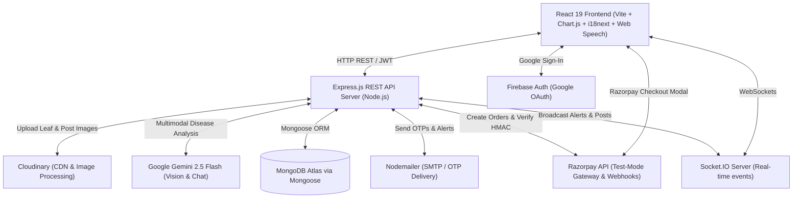

# 🌾 KissanSarthi (किसान सारथी)
> **Full-Stack Smart Agriculture Decision Support, AI Vision Diagnostics, Produce Marketplace & Expert Consultation Platform**

[](LICENSE)
[](https://react.dev/)
[](https://vitejs.dev/)
[](https://nodejs.org/)
[](https://www.mongodb.com/)
[](https://deepmind.google/technologies/gemini/)
[](https://cloudinary.com/)
[](https://razorpay.com/)
[](https://socket.io/)
[](https://www.i18next.com/)

**KissanSarthi** is an enterprise-grade agricultural operating system engineered to empower Indian farmers, agronomists, and agricultural buyers. It bridges the gap between digital intelligence and physical farming by providing **direct-to-buyer produce trading (bypassing middlemen)**, **1-on-1 certified expert consultations (Razorpay)**, **personalized government scheme eligibility**, **precision NPK calculations**, **IoT microclimate telemetry**, and **real-time APMC Mandi market rates**.

---

## 🎯 Quick Demo & Viva Examiner Credentials

For immediate evaluation, testing, or viva demonstration, use the pre-configured seed credentials below:

| Role | Email | Password | Access Highlights |
|---|---|---|---|
| **🌾 Verified Farmer** | `farmer@kissansarthi.in` | `Password@123` | Full dashboard, produce listing, expert booking, community |
| **🔬 Agri Expert** | `expert.ramesh@kissansarthi.in` | `Password@123` | Consultation queue, expert profile, diagnostic advice |
| **🛡️ System Admin** | `admin@kissansarthi.in` | `Admin@123` | User moderation, KYC land verification queue, telemetry oversight |
| **🚜 Seeded Farmer (North)** | `ramesh.yadav.demo@kissansarthi.test` | `123456` | Wheat farmer (Samba, J&K) — Direct login, OTP bypassed |
| **🚜 Seeded Farmer (West)** | `manoj.patel.demo@kissansarthi.test` | `123456` | Cotton farmer (Anand, Gujarat) — Direct login, OTP bypassed |
| **🚜 Seeded Farmer (Central)** | `devendra.chouhan.demo@kissansarthi.test` | `123456` | Soybean farmer (Indore, MP) — Direct login, OTP bypassed |

> 💡 **10 Dummy Indian Farmer Accounts Available**: All 10 regional farmer accounts (from Punjab, Rajasthan, Gujarat, Maharashtra, Karnataka, Tamil Nadu, Bihar, MP, and J&K) use password `123456` and have `isVerified: true` pre-configured to bypass OTP verification completely. Ready for testing Pro upgrade and KYC verification flows.

### 💳 Razorpay Test Payment Details (Viva Safe — No Real Money Deducted)
When testing **KissanSarthi Pro Subscriptions**, **Marketplace Priority Boosts (₹20)**, or **Expert Consultations (₹79–₹199)**:
- **Card Number**: `4111 1111 1111 1111`
- **Expiry Date**: Any future date (e.g., `12/28`)
- **CVV**: `123`
- **OTP**: `1234`
- *All webhooks & server-side HMAC-SHA256 signature verification run in real-time in sandbox mode.*

---

## 📋 Table of Contents

- [Features Overview](#-features-overview)
- [Architecture & Tech Stack](#-architecture--tech-stack)
- [Project Directory Structure](#-project-directory-structure)
- [Database Models & Schemas](#-database-models--schemas)
- [API Route Reference](#-api-route-reference)
- [Real-Time WebSockets](#-real-time-websockets)
- [Security & Middlewares](#-security--middlewares)
- [Getting Started & Installation](#-getting-started--installation)
- [Environment Variables](#-environment-variables)
- [Database Seeding](#-database-seeding)
- [Future Roadmap](#-future-roadmap)
- [License](#-license)

---

## ✨ Features Overview

### 🛒 1. Direct-to-Buyer Produce Marketplace (`/marketplace`)
- **Middleman-Free Trading**: Farmers list harvested crops (quantity, expected price per quintal, harvest date, location) directly to buyers and food processing units.
- **APMC Mandi Price Benchmark**: Embedded real-time mandi rate comparison ensures farmers price competitively without getting underpaid.
- **Priority Listing Boost (Razorpay)**: Farmers can boost listings for ₹20 to appear pinned at the top with a ⭐ Gold badge.
- **Verified Farmer Badge**: Listings prominently display verified farmer KYC badges for buyer trust.
- **Phone Number Privacy Masking**: Contact numbers are protected until authenticated buyers unlock them.

### 👨‍🌾 2. Agri-Expert Consultations (`/experts`)
- **1-on-1 Agronomist Consultations**: Browse verified agronomists, soil chemists, plant pathologists, and organic farming specialists.
- **Transparent Fee Structure**: Seeded specialist profiles display years of experience, university credentials, peer ratings, and per-session fees.
- **Razorpay Booking Integration**: Book consultations seamlessly with instant test-mode payment capture and status tracking.

### 🏛️ 3. Government Schemes Hub (`/schemes`)
- **Central & State Scheme Directory**: Aggregates flagship initiatives like PM-KISAN, PMFBY Crop Insurance, PMKSY Micro-Irrigation, and Soil Health Cards.
- **Automated Eligibility Engine**: Automatically filters schemes based on user profile (farm size in acres, state, and cultivated crop).
- **Localized Content**: Scheme titles and summaries available in English, Hindi, and Gujarati.
- **One-Click Bookmarks**: Save schemes for offline reference or CSC center applications.

### ⭐ 4. KissanSarthi Pro Subscription Tiers (`/pricing`)
- **Tiered Access Model**:
  - **Free Kisan Plan (₹0/mo)**: Basic IoT telemetry, weather forecast, community access.
  - **KissanSarthi Pro (₹299/mo or ₹2,499/yr)**: Zero marketplace commission, priority buyer ranking, 2 free expert consultations, and PDF invoice receipts.
- **Interactive Pricing Matrix**: Side-by-side cards with SVG checkmarks, colored ribbon, and collapsible examiner test-mode instructions.

### 🪪 5. Verified Farmer KYC & Profile (`/profile`)
- **Digital Land Verification**: Upload land records (Khasra/Khatauni/7/12) for admin verification.
- **Farmer Trust Badge**: Verified profile receives a green badge visible across community posts and marketplace listings.
- **Transaction History & PDF Receipts**: Download official PDF payment receipts for subscriptions, boosts, and consultations.

### 📊 6. Farm Telemetry & Real-Time Dashboard (`/`)
- **IoT Sensor Monitoring**: Live metrics for Soil Moisture, Temperature, Soil pH, and NPK (Nitrogen, Phosphorus, Potassium).
- **Farm Health Index**: Aggregate agronomic score calculating real-time field productivity.
- **Live System Alerts**: Automated warnings for frost risk, low soil moisture, or fertilizer deficits.
- **Visual Analytics**: Interactive trend graphs built with Chart.js.

### 🌤️ 7. Smart Farming Weather Advisor (`/weather`)
- **7-Day Microclimate Forecast**: Tailored for agricultural decision-making.
- **Irrigation Guidance**: Algorithmic advice on when to irrigate vs. defer based on rainfall probability.
- **Spray Window Optimizer**: Identifies wind and precipitation windows suitable for safe pesticide application.

### 🤖 8. AI Crop Recommendation Engine (`/crop`)
- **Soil & Climate Matching**: Input field parameters (Soil Type, Season, NPK values, pH, Rainfall).
- **Yield & Variety Predictions**: Recommends optimal crops with estimated yield per acre and agronomic care tips.

### 📈 9. Mandi Price Tracker & Trend Analysis (`/market`)
- **Live Mandi Rates**: Real-time price tracking for commodities across major Indian agricultural markets.
- **Filter & Search**: Query by state, district, and commodity name with historical trend charts.

### 🧪 10. Precision Fertilizer Calculator (`/fertilizer`)
- **Growth-Stage Calculations**: Stage-specific dosage recommendations (Sowing, Vegetative, Flowering, Maturity).
- **Soil Deficit Adjustments**: Computes required urea, DAP, and MOP bags based on target crop and soil test gaps.

### 👥 11. Farmer Community & Social Knowledge Base (`/community`)
- **Peer-to-Peer Knowledge Feed**: Post crop insights, photos, disease queries, and equipment experiences.
- **Rich Interaction**: Likes, threaded replies, bookmarking, and farmer follow graph.
- **Content Moderation**: User reporting pipeline and admin moderation queue.

### 💬 12. KissanBot AI Assistant with Voice Input
- **Multilingual Farming Chatbot**: Powered by Gemini 2.5 Flash with agronomic prompt engineering.
- **Web Speech API**: Hands-free voice input in vernacular languages—ideal for farmers working in the field.

### 🌐 13. Vernacular Localization (i18n)
- Seamless real-time switching between **English**, **हिंदी (Hindi)**, and **ગુજરાતી (Gujarati)** via `react-i18next`.

### 🛡️ 14. Admin Control Center (`/admin`)
- **Live Platform Telemetry**: Active farmers, Gemini query counts, system health metrics.
- **KYC Verification Queue**: Review submitted farmer land records and approve/reject with one click.
- **Moderation Queue**: Resolve flagged community posts and manage platform safety.

---

## 🏗️ Architecture & Tech Stack



### **Frontend**
- **Framework**: React 19 + Vite 8
- **Design System**: Responsive inline theme tokens (`src/constants/theme.js`), Custom Card & Badge components
- **State Management**: React Context (`AuthContext`), React Hooks
- **Routing**: `react-router-dom` v7
- **Charts & Visualization**: `chart.js` & `react-chartjs-2`
- **Animations & Notifications**: `framer-motion`, `react-hot-toast`
- **Payments**: Razorpay Standard Checkout SDK
- **Speech Recognition**: Browser Web Speech API (`webkitSpeechRecognition`)
- **Internationalization**: `i18next`, `react-i18next`, `i18next-browser-languagedetector`

### **Backend**
- **Runtime & Server**: Node.js, Express.js (ES Modules)
- **Database**: MongoDB Atlas with Mongoose ORM
- **AI Vision Engine**: `@google/genai` (Gemini 2.5 Flash Vision & Text)
- **Image CDN**: `cloudinary`, `multer-storage-cloudinary`
- **Payment Processing**: `razorpay` Node SDK with HMAC-SHA256 signature verification
- **Real-Time Engine**: Socket.IO
- **Security**: Helmet, Express Rate Limit, Mongo Sanitize, CORS, Cookie Parser, Express Validator
- **Authentication**: JWT (Access + Refresh Tokens in HTTP-Only cookies), Bcrypt.js, OTP verification

---

## 📂 Project Directory Structure

```text
KissanSarthi/
├── backend/                         # Express.js REST Backend
│   ├── src/
│   │   ├── config/                  # MongoDB, Cloudinary, Razorpay, Winston logger
│   │   ├── controllers/             # Business controllers:
│   │   │   ├── admin.controller.js
│   │   │   ├── alert.controller.js
│   │   │   ├── auth.controller.js
│   │   │   ├── chat.controller.js
│   │   │   ├── community.controller.js
│   │   │   ├── consultation.controller.js
│   │   │   ├── crop.controller.js
│   │   │   ├── dashboard.controller.js
│   │   │   ├── fertilizer.controller.js
│   │   │   ├── market.controller.js
│   │   │   ├── marketplace.controller.js
│   │   │   ├── payment.controller.js
│   │   │   ├── scheme.controller.js
│   │   │   ├── sensor.controller.js
│   │   │   └── weather.controller.js
│   │   ├── middlewares/            # Auth, Admin guard, Cloudinary upload, Error handling
│   │   ├── models/                 # Mongoose schemas (User, MarketListing, Payment, Consultation, etc.)
│   │   ├── routes/                 # API endpoint routers
│   │   ├── seeds/                  # Automated DB seeders (seedExperts.js, seed.js)
│   │   ├── services/               # Gemini AI Advisory service, Weather & Mandi services
│   │   ├── sockets/                # Socket.IO event handlers
│   │   ├── utils/                  # Razorpay signature validator, PDF receipt builder
│   │   ├── app.js                  # Express app initialization
│   │   └── server.js               # HTTP & WebSocket server entrypoint
│   ├── .env.example                # Backend environment template
│   └── package.json
├── src/                             # React 19 Frontend
│   ├── assets/                     # Static images, icons, illustrations
│   ├── components/                 # Reusable UI components:
│   │   ├── auth/                   # AuthModal, GoogleAuthButton
│   │   ├── common/                 # Card, Badge, Icon, Button, StatPills, ErrorBoundary
│   │   ├── chat/                   # Floating KissanBot AI chat + Voice input
│   │   ├── community/              # PostCard, CommentSection, CreatePostModal
│   │   └── layout/                 # Navbar, Sidebar, Page Shell
│   ├── constants/                  # Theme tokens, colors, navigation items
│   ├── context/                    # AuthContext (user, session, KYC status)
│   ├── i18n/                       # Translation bundles (en, hi, gu)
│   ├── pages/                      # Application views:
│   │   ├── Admin.jsx               # Admin dashboard & KYC verification queue
│   │   ├── Community.jsx           # Peer-to-peer social feed
│   │   ├── CropPage.jsx            # Crop recommendation engine
│   │   ├── Dashboard.jsx           # Main farm telemetry & overview
│   │   ├── Experts.jsx             # Agronomist consultation booking
│   │   ├── Fertilizer.jsx          # Stage-wise fertilizer calculator
│   │   ├── Market.jsx              # Mandi price trends
│   │   ├── Marketplace.jsx         # Produce exchange & priority boosts
│   │   ├── Pricing.jsx             # Free vs Pro subscription cards
│   │   ├── Profile.jsx             # Farmer profile & payment receipts
│   │   ├── Schemes.jsx             # Government schemes directory & filter
│   │   └── Weather.jsx             # Microclimate weather advisor
│   ├── services/                   # Axios API client (api.js)
│   ├── utils/                      # Razorpay modal launcher, formatters
│   ├── App.jsx                     # Router config & protected routes
│   └── main.jsx                    # React root with ErrorBoundary
├── .env.example                    # Frontend environment template
├── index.html                      # HTML5 shell
├── vite.config.js                  # Vite configuration
└── package.json
```

---

## 🗄️ Database Models & Schemas

| Model | Key Fields | Description |
|---|---|---|
| `User` | `name`, `email`, `password`, `role`, `isVerified`, `verificationStatus`, `landDocumentUrl`, `subscription`, `preferredLanguage`, `experienceYears`, `consultationFee`, `availableForConsultation` | Comprehensive user credentials, roles (`farmer`, `expert`, `admin`), KYC verification, and subscription status. |
| `MarketListing` | `sellerId`, `cropName`, `category`, `quantity`, `unit`, `pricePerUnit`, `location`, `state`, `district`, `images`, `isBoosted`, `boostExpiresAt`, `status`, `contactNumber` | Agricultural produce listings for direct-to-buyer marketplace with boost flags. |
| `Payment` | `userId`, `purpose`, `amount`, `currency`, `razorpayOrderId`, `razorpayPaymentId`, `razorpaySignature`, `status`, `relatedId`, `metadata` | Audit log of all financial transactions (subscriptions, boosts, consultations). |
| `Consultation` | `farmerId`, `expertId`, `problemDescription`, `crop`, `consultationFee`, `paymentId`, `status`, `scheduledTime`, `notes` | Expert booking sessions with payment linkage and resolution notes. |
| `Scheme` | `title`, `titleHi`, `titleGu`, `category`, `eligibility`, `benefits`, `documentsRequired`, `applyUrl`, `state` | Government agricultural schemes with multilingual translations. |
| `CommunityPost` | `author`, `title`, `content`, `media`, `category`, `tags`, `likes`, `shares`, `moderationStatus` | Community post entries with Cloudinary image attachments. |
| `SensorData` | `nodeId`, `temperature`, `soilMoisture`, `pH`, `nitrogen`, `phosphorus`, `potassium`, `humidity` | Telemetry readings from field sensor hardware or simulators. |
| `CropRecommendation` | `userId`, `soilType`, `season`, `NPK`, `pH`, `recommendedCrop`, `yieldPrediction`, `tips` | History of AI crop recommendations. |
| `FertilizerHistory` | `userId`, `crop`, `growthStage`, `targetNPK`, `dosageRecommendations` | Historical fertilizer calculations. |
| `MarketPrice` | `commodity`, `mandiName`, `state`, `district`, `modalPrice`, `date` | Mandi commodity price indices. |
| `Alert` | `user`, `type`, `title`, `message`, `severity`, `isRead` | Critical alerts for sensor thresholds and weather risks. |

---

## 🔌 API Route Reference

Base URL: `http://localhost:5000/api`

### 🛒 Produce Marketplace (`/api/marketplace`)
- `GET /api/marketplace` - Fetch active produce listings (filter by category, crop, location).
- `POST /api/marketplace` - Create produce listing with Cloudinary image uploads (`authRequired`).
- `GET /api/marketplace/my` - Fetch farmer's own listings.
- `PATCH /api/marketplace/:id` - Update listing or mark as `sold` / `active`.
- `POST /api/marketplace/:id/reveal-contact` - Securely reveal seller contact number to authenticated buyer.

### 💳 Payments & Billing (`/api/payments`)
- `POST /api/payments/create-order` - Create a Razorpay test-mode order (`purpose: subscription | priority_listing | consultation`).
- `POST /api/payments/verify` - Verify Razorpay payment via HMAC-SHA256 signature and fulfill service.
- `GET /api/payments/history` - Retrieve user transaction history.
- `GET /api/payments/receipt/:id` - Generate and download official PDF invoice receipt.

### 👨‍🌾 Expert Consultations (`/api/consultations`)
- `GET /api/consultations/experts` - List verified agricultural experts with ratings & fees.
- `POST /api/consultations/book` - Initiate a consultation booking linked to a Razorpay order.
- `GET /api/consultations/my` - View booked sessions (for both farmers and experts).
- `PATCH /api/consultations/:id/status` - Update consultation status (`scheduled`, `completed`, `cancelled`).

### 🏛️ Government Schemes (`/api/schemes`)
- `GET /api/schemes` - List government schemes with profile-matching filters (`onlyEligible=true`).
- `POST /api/schemes/:id/bookmark` - Toggle bookmark on a scheme.
- `GET /api/schemes/:id` - View complete details of a specific scheme.

### 🔑 Authentication & Profile (`/api/auth`)
- `POST /api/auth/register` - Register user (sends email OTP).
- `POST /api/auth/login` - Authenticate user & issue JWT cookies.
- `POST /api/auth/verify-otp` - Verify 6-digit email OTP.
- `POST /api/auth/forgot-password` - Request password reset token.
- `POST /api/auth/reset-password` - Reset password using verified token.
- `GET /api/auth/profile` - Fetch authenticated user profile and subscription tier.
- `PUT /api/auth/profile` - Update profile details & farm coordinates.
- `POST /api/auth/verify-farmer` - Submit land records for KYC verification (`multipart/form-data`).

### 👥 Community (`/api/posts`)
- `GET /api/posts` - Paginated community post feed.
- `POST /api/posts` - Create post with media attachments.
- `POST /api/posts/:id/like` - Toggle like.
- `POST /api/posts/:id/comment` - Add comment or reply.
- `POST /api/posts/:id/report` - Flag inappropriate content for admin review.

### 💬 AI KissanBot Chat (`/api/chat`)
- `POST /api/chat` - Query Gemini agricultural conversational assistant.
- `GET /api/chat/history` - Fetch conversation history.

### 🛡️ Admin Management (`/api/admin`)
- `GET /api/admin/dashboard` - Platform-wide telemetry (users, active queries, server health).
- `GET /api/admin/users` - Paginated user management list.
- `GET /api/admin/verifications` - Review pending farmer KYC land documents.
- `POST /api/admin/verifications/:userId` - Approve or reject farmer verification.
- `GET /api/admin/reports` - Review flagged community posts.

---

## ⚡ Real-Time WebSockets

KissanSarthi uses **Socket.IO** for low-latency push notifications:
- `sensor_update` - Live telemetry data stream from IoT field nodes.
- `alert_new` - Instant push notifications for frost warnings, pests, or disease alerts.
- `post_new` / `post_liked` - Live community feed interactions without manual page reloads.

---

## 🛡️ Security & Middlewares

1. **HMAC-SHA256 Signature Verification**: All Razorpay webhooks and client checkout callbacks are cryptographically verified server-side before activating subscriptions or listings.
2. **Dual-Token JWT Security**: Short-lived Access Tokens (15 min) + Refresh Tokens (7 days) stored in HTTP-Only, SameSite cookies.
3. **Role-Based Access Control (RBAC)**: Strict role barriers (`farmer`, `expert`, `admin`) enforced by middleware.
4. **Cloudinary File Sanitization**: File uploads are restricted to JPG/PNG/WebP with 5MB limits and virus-scanned on CDN ingestion.
5. **NoSQL Injection & XSS Guard**: Automated sanitization with `express-mongo-sanitize` and `xss-clean`.
6. **Rate Limiting**: `express-rate-limit` prevents brute-force login and API abuse.

---

## 🛠️ Getting Started & Installation

### Prerequisites
- **Node.js** (`v18.0.0` or higher)
- **npm** (`v9.0.0` or higher)
- **MongoDB** (Local instance or MongoDB Atlas Cloud URI)

---

### Step 1: Clone the Repository
```bash
git clone https://github.com/your-username/KissanSarthi.git
cd KissanSarthi
```

---

### Step 2: Backend Setup
1. Navigate to the backend directory:
   ```bash
   cd backend
   ```
2. Install dependencies:
   ```bash
   npm install
   ```
3. Create your `.env` file based on `.env.example`:
   ```bash
   cp .env.example .env
   ```
   *(Configure your `MONGODB_URI`, `CLOUDINARY_*`, `RAZORPAY_*`, and `GEMINI_API_KEY`)*

4. Seed the database with sample farmers, expert profiles, mandi rates, and schemes:
   ```bash
   npm run seed
   ```

5. Start the backend server:
   ```bash
   npm run dev
   ```
   *The backend API will run on `http://localhost:5000`.*

---

### Step 3: Frontend Setup
1. Open a new terminal window and navigate to the frontend directory:
   ```bash
   cd KissanSarthi
   ```
2. Install dependencies:
   ```bash
   npm install
   ```
3. Create frontend `.env` file:
   ```bash
   cp .env.example .env
   ```
   *(Verify `VITE_API_URL=http://localhost:5000/api` and `VITE_RAZORPAY_KEY_ID`)*

4. Start the Vite development server:
   ```bash
   npm run dev
   ```
   *Open `http://localhost:5173` in your browser.*

---

## ⚙️ Environment Variables

### **Backend (`backend/.env`)**
```env
NODE_ENV=development
PORT=5000
MONGODB_URI=mongodb+srv://<username>:<password>@cluster.mongodb.net/kissansarthi?retryWrites=true&w=majority

# JWT Credentials
JWT_ACCESS_SECRET=your_super_secret_access_key_min_32_chars
JWT_REFRESH_SECRET=your_super_secret_refresh_key_min_32_chars
JWT_ACCESS_EXPIRES=15m
JWT_REFRESH_EXPIRES=7d

# CORS Client Base URL
CLIENT_URL=http://localhost:5173

# Rate Limiting
RATE_LIMIT_WINDOW_MS=900000
RATE_LIMIT_MAX=100

# Google Gemini AI Advisory & Chat API
GEMINI_API_KEY=your_gemini_api_key_here

# Cloudinary Storage Configuration
CLOUDINARY_CLOUD_NAME=your_cloudinary_cloud_name
CLOUDINARY_API_KEY=your_cloudinary_api_key
CLOUDINARY_API_SECRET=your_cloudinary_api_secret

# Razorpay Test Mode Configuration
RAZORPAY_KEY_ID=rzp_test_placeholder_key_id
RAZORPAY_KEY_SECRET=your_razorpay_secret_here

# External APIs
OPENWEATHER_API_KEY=your_openweather_api_key
MANDI_API_KEY=/resource/9ef84268-d588-465a-a308-a864a43d0070

# Nodemailer SMTP Settings for Email OTP
EMAIL_HOST=smtp.gmail.com
EMAIL_PORT=465
EMAIL_SECURE=true
EMAIL=your_email@gmail.com
EMAIL_PASSWORD="your_app_password"
EMAIL_FROM="KissanSarthi <noreply@kissansarthi.com>"
```

### **Frontend (`.env`)**
```env
VITE_API_URL=http://localhost:5000/api
VITE_SOCKET_URL=http://localhost:5000
VITE_RAZORPAY_KEY_ID=rzp_test_placeholder_key_id
```

---

## 🌱 Database Seeding

The project includes automated seeding scripts to instantly populate your environment with test data:

```bash
cd backend
npm run seed
```

This populates:
- **Default Users & Roles**: Admin (`admin@kissansarthi.in`), Farmer (`farmer@kissansarthi.in`), and 5 Certified Experts (`expert.ramesh@kissansarthi.in`, etc.).
- **Expert Profiles**: Soil scientists, plant pathologists, and organic farming specialists with ratings and fees.
- **Government Schemes Hub**: PM-KISAN, PMFBY, Soil Health Card, and Micro-Irrigation schemes with multilingual titles.
- **Produce Marketplace**: Sample listings with categories, quantities, and mandi benchmarks.
- **Telemetry & Mandi Data**: IoT sensor records and APMC market prices.

---

## 🚀 Future Roadmap

- 🛰️ **Satellite Field Mapping & NDVI Imagery**: Integration with Sentinel-2 / NASA Earth data for farm vegetative health tracking.
- 📱 **Progressive Web App (PWA) Offline Sync**: Offline caching for weather advisories and fertilizer calculations in remote rural zones.
- 📲 **IVR & Telephony Voice Gateway**: Integration with Twilio/Exotel to deliver critical weather alerts to non-smartphone feature phones.
- 🚁 **Autonomous Drone Spraying Interface**: Telemetry dispatch API for agricultural pesticide drones.

---

## 📄 License

This project is open-source and released under the [MIT License](LICENSE).

---

<p align="center">
  Built with ❤️ for Indian Agriculture by <strong>Team KissanSarthi</strong> 🌾
</p>